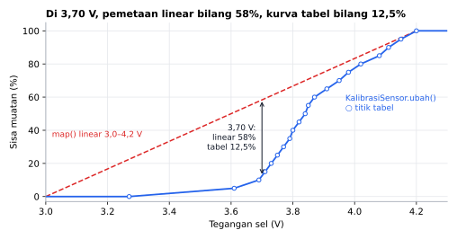
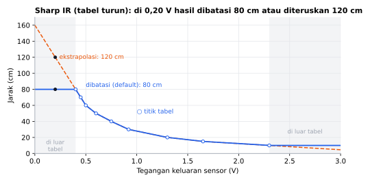
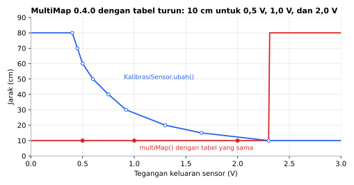

# KalibrasiSensor

[English](README.en.md)

Library Arduino berbahasa Indonesia untuk **mengubah bacaan mentah sensor menjadi nilai nyata** lewat tabel titik ukur. Di antara titik, nilai dihitung dengan interpolasi linear. Cocok untuk sensor tidak linear (persen baterai, Sharp IR, termistor) maupun sensor linear (cukup dua titik).

```cpp
const float VOLT[]   = {3.27, 3.69, 3.80, 3.87, 4.02, 4.20};
const float PERSEN[] = {0,    10,   40,   60,   80,   100};
KalibrasiSensor baterai(VOLT, PERSEN, 6);

float persen = baterai.ubah(volt);
```

## Fitur

- **Interpolasi linear sepotong-sepotong**: garis lurus di antara setiap dua titik ukur, tepat di titik ukur itu sendiri.
- **Tabel naik atau turun** sama-sama boleh. Sharp IR (tegangan turun saat jarak bertambah) dan sensor tanah kapasitif (bacaan turun saat basah) tidak perlu dibalik dulu.
- **Tabel diperiksa**. `mulai()` dan `valid()` bernilai `false` jika titik kurang dari 2 atau bacaan mentah tidak urut (ada yang kembar atau berbalik arah). Tabel salah menghasilkan `NAN`, bukan angka yang tampak benar.
- **Di luar rentang**: dibatasi ke titik ujung (default) atau diteruskan dengan ekstrapolasi.
- **Kalibrasi dua titik** untuk sensor linear: cukup tabel 2 titik dan `aturEkstrapolasi(true)`.
- **Tabel di flash (PROGMEM)** di AVR: tabel 10 titik menghemat 80 byte RAM Uno.
- **Tabel tidak disalin**. Objek hanya 6 byte di Uno, dan isi tabel boleh diubah saat berjalan (mis. hasil kalibrasi yang disimpan di EEPROM), cukup panggil `mulai()` lagi.

## Board yang didukung

| Board | Teruji compile |
|---|---|
| Arduino Uno / Nano | ✅ |
| Arduino Mega | CI |
| ESP32 DevKit | ✅ |
| ESP32-C3 / S3 | CI |
| STM32 Blackpill F411 | CI |
| STM32 Bluepill F103 | ✅ |

✅ = dicompile tanpa warning saat rilis. CI = dicompile otomatis oleh GitHub Actions setiap ada perubahan.

Library ini murni perhitungan (tanpa akses hardware), jadi seharusnya bekerja di board Arduino apa pun.

## Instalasi

**Library Manager:** Arduino IDE → *Sketch → Include Library → Manage Libraries…* → cari **KalibrasiSensor** → *Install*.

**Manual:** unduh ZIP dari GitHub → *Sketch → Include Library → Add .ZIP Library…*

## Contoh cepat

```cpp
#include <KalibrasiSensor.h>

// Sensor IR Sharp GP2Y0A21: tegangan (V) -> jarak (cm). Tabel turun pun boleh.
const float VOLT[] = {2.30, 1.65, 1.30, 0.92, 0.75, 0.60, 0.50, 0.45, 0.40};
const float CM[]   = {10,   15,   20,   30,   40,   50,   60,   70,   80};
KalibrasiSensor sharp(VOLT, CM, 9);

void setup() {
  Serial.begin(115200);
  if (!sharp.mulai()) Serial.println("Tabel kalibrasi salah!");
}

void loop() {
  float volt = analogRead(A0) * 5.0 / 1023;
  Serial.println(sharp.ubah(volt));   // jarak dalam cm
  delay(100);
}
```

## Hasil simulasi

Grafik di bawah adalah **simulasi di PC** yang memanggil `ubah()` dengan tabel dari contoh `PersenBaterai` dan `SharpIRJarak`, bukan pengukuran sensor sungguhan. Kurva baterai adalah perkiraan dari tabel komunitas, bukan datasheet sel tertentu.



Pemetaan linear seperti `map()` menganggap 3,70 V masih 58%, padahal menurut kurva tabel baterai tinggal 12,5%. Sebagian besar kapasitas ada di 3,7–4,0 V, jadi baterai "linear" terlihat penuh lalu tiba-tiba habis.



Tabel turun (tegangan makin kecil saat jarak makin jauh) dipakai apa adanya. Di luar rentang tabel (area abu-abu), hasil dibatasi ke titik ujung secara default. Dengan `aturEkstrapolasi(true)` garis ruas terakhir diteruskan, yang untuk Sharp IR cepat menjadi tidak masuk akal.



Pembanding: fungsi `multiMap()` dari library MultiMap 0.4.0 (disalin dari source-nya ke program simulasi) dengan tabel Sharp IR yang sama. Karena mengira tabel selalu naik, hasilnya 10 cm untuk semua tegangan sampai 2,30 V dan 80 cm di atasnya.

Grafik dibuat dari simulasi di PC yang menjalankan kode library ini (`extras/simulasi`):

```sh
cd extras/simulasi
python gambar.py   # butuh g++ dan matplotlib
```

## Kecepatan & memori

Diukur dengan simavr (simulator ATmega328P yang akurat per siklus) di Arduino Uno 16 MHz. Masukan bergilir di seluruh rentang tabel agar semua ruas terkena. Pembanding: MultiMap 0.4.0 (`multiMap<float>`, `multiMapBS<float>`) dan InterpolationLib 1.0.2 (`Interpolation::Linear`, `double` = `float` di Uno).

| `ubah()` | KalibrasiSensor 1.0.1 | KalibrasiSensor 1.0.0 | MultiMap 0.4.0 | InterpolationLib 1.0.2 |
|---|---|---|---|---|
| 2 titik (linear) | 1.566 siklus (98 µs) | 2.097 (131 µs) | 1.516 (95 µs) | - |
| 8 titik (baterai Li-ion) | 2.023 (126 µs) | 3.311 (207 µs) | 1.917 (120 µs) | 1.990 (124 µs) |
| 8 titik, tabel `PROGMEM` | 2.067 (129 µs) | 3.371 (211 µs) | tidak bisa | tidak bisa |
| 32 titik | 2.208 (138 µs) | 5.913 (370 µs) | 2.884 (180 µs); `multiMapBS` 1.817 | 2.730 (171 µs) |
| RAM per objek | 6 B | 8 B | 0 (fungsi) | 0 (fungsi) |
| Flash tambahan (8 titik) | 1.842 B | 1.778 B | 1.488 B | 1.398 B |

`ubah()` O(log n) waktu (binary search ruas) dan O(1) memori; `mulai()` O(n). Optimasi di 1.0.1, dengan hasil sama persis seperti 1.0.0 (diuji di `extras/test` untuk tabel 2–40 titik, naik/turun, dengan dan tanpa ekstrapolasi):
- Arah tabel (naik/turun) disimpan sekali di `mulai()`, jadi pencarian tidak lagi mengalikan setiap titik dengan ±1. Perkalian float di AVR ±130 siklus, pembanding jauh lebih murah.
- Pencarian ruas memakai binary search: 32 titik 2,7× lebih cepat.
- Status disimpan sebagai bit, objek turun dari 8 ke 6 byte.

Di mana kita kalah: untuk tabel kecil MultiMap dan InterpolationLib ±50–100 siklus lebih cepat dan ±350–450 byte lebih kecil di flash. Selisih itu untuk memeriksa tabel (urut, tidak kembar, `NAN`), mendukung tabel turun, `PROGMEM`, dan ekstrapolasi. `multiMapBS` 18% lebih cepat di 32 titik karena tidak memeriksa apa pun dan hanya untuk tabel naik.

Di ESP32 dan STM32 `src/` bebas promosi `float` → `double` (`-Wdouble-promotion`). Mengulang pengukuran: sketch `extras/benchmark/KalibrasiSensorBenchmark` (butuh simavr).

## Kalibrasi dua titik

Untuk sensor linear (sensor tekanan, sensor arus, load cell lewat ADC, pembagi tegangan), ukur bacaan mentah di dua keadaan yang nilai nyatanya diketahui:

```cpp
const float BACAAN[] = {103, 785};  // analogRead() saat 0 MPa dan saat 0,8 MPa
const float MPA[]    = {0.0, 0.8};
KalibrasiSensor tekanan(BACAAN, MPA, 2);

void setup() {
  tekanan.aturEkstrapolasi(true);   // teruskan garis di luar kedua titik
}
```

Untuk persen (kelembapan tanah kering → 0%, basah → 100%), biarkan ekstrapolasi mati agar hasil tetap 0–100.

## Tabel di flash (AVR)

Arduino Uno hanya punya 2 KB RAM, dan tabel `const float` biasa tetap ditaruh di RAM. Tambahkan `PROGMEM` dan `KalibrasiSensor::DI_FLASH`:

```cpp
const float VOLT[]   PROGMEM = {...};
const float PERSEN[] PROGMEM = {...};
KalibrasiSensor baterai(VOLT, PERSEN, 21, KalibrasiSensor::DI_FLASH);
```

Di ESP32 dan STM32, `PROGMEM` tidak berpengaruh dan `DI_FLASH` diabaikan, jadi sketch yang sama tetap jalan.

## Referensi fungsi

| Fungsi | Keterangan |
|---|---|
| `KalibrasiSensor(const float *mentah, const float *nyata, uint8_t jumlah, Lokasi lokasi = DI_RAM)` | Tabel `jumlah` titik (2–255). `mentah[i]` berpasangan dengan `nyata[i]`. Tabel tidak disalin, jadi harus tetap ada (global atau `static`). |
| `bool mulai()` | Periksa tabel. `false` jika titik < 2 atau `mentah[]` tidak urut naik/turun. Sudah dipanggil oleh constructor; panggil lagi setelah isi tabel diubah. |
| `bool valid()` | Hasil pemeriksaan terakhir. |
| `float ubah(float bacaan)` | Bacaan mentah → nilai nyata. `NAN` jika tabel tidak valid. |
| `void aturEkstrapolasi(bool aktif)` | `false` (default): di luar rentang dibatasi ke nilai ujung. `true`: garis dua titik terdekat diteruskan. |

| Lokasi | Keterangan |
|---|---|
| `KalibrasiSensor::DI_RAM` | Tabel biasa (default). |
| `KalibrasiSensor::DI_FLASH` | Tabel ber-`PROGMEM`. Hemat RAM di AVR (Uno, Nano, Mega). |

Hanya `mentah[]` yang harus urut. `nyata[]` boleh naik, turun, atau berbelok.

## Contoh yang tersedia

*File → Examples → KalibrasiSensor*

| Contoh | Isi |
|---|---|
| `PersenBaterai` | Persen Li-ion 1 sel dari tegangan, tabel 21 titik di flash. |
| `KelembapanTanahPersen` | Sensor tanah kering/basah → 0–100%. |
| `SharpIRJarak` | Sharp GP2Y0A21 tegangan → cm (tabel turun). |
| `KalibrasiDuaTitik` | Sensor tekanan linear dengan dua titik ukur dan ekstrapolasi. |
| `MencatatTitikKalibrasi` | Mengukur titik sendiri lewat Serial Monitor, lalu mencetak tabel siap salin. |

Kurva baterai di `PersenBaterai` adalah **perkiraan** dari tabel yang umum dipakai komunitas untuk sel Li-ion/LiPo 3,7 V saat istirahat, bukan dari datasheet sel tertentu. Titik Sharp IR dibaca kira-kira dari grafik datasheet. Untuk hasil teliti, ukur sensor kamu sendiri dengan `MencatatTitikKalibrasi`.

## Dibanding library lain

Dari membaca source code dan mencobanya di PC (Oktober 2026):

| Library | Temuan |
|---|---|
| MultiMap | Tabel masukan harus naik dan tidak diperiksa. Dengan tabel Sharp IR yang turun, `multiMap()` mengembalikan 10 cm untuk 2,0 V, 1,0 V, dan 0,5 V. Parameter tabel bukan `const`, jadi `multiMap<float>()` dengan tabel `const float` gagal compile. Selalu dibatasi, tanpa ekstrapolasi. Tanpa dukungan PROGMEM. `multiMapCache()` memakai variabel `static` yang dibagi semua tabel bertipe sama: dua tabel berbeda dengan masukan 50 sama-sama menghasilkan 5,0 (yang kedua seharusnya 500). |
| InterpolationLib | Tabel `double[]` bukan `const` dan harus naik, tanpa pemeriksaan urutan. Mendukung ekstrapolasi (`trim = false`). |

KalibrasiSensor menerima tabel naik maupun turun, memeriksa urutannya, dan menerima tabel `const` maupun `PROGMEM`.

## Pengujian

Interpolasi diuji otomatis di PC (`extras/test`): titik persis, di antara titik, di luar rentang (dibatasi dan ekstrapolasi), tabel turun, nilai nyata turun, tabel tidak urut/kembar/`NAN`/kurang dari 2 titik, tabel diubah saat berjalan, dua titik, dan tabel 255 titik.

```sh
cd extras/test
g++ -std=c++11 -I. -I../../src uji.cpp ../../src/*.cpp -o uji && ./uji
```

## Status

Versi 1.0.1 sudah lolos uji logika otomatis di PC dan compile tanpa warning di Uno, ESP32, dan STM32 Bluepill (CI menguji 7 board). Jalur `DI_FLASH` sudah dijalankan di simulator ATmega328P (simavr) dengan hasil sama dengan tabel di RAM, tapi belum di board sungguhan. Jika menemukan masalah, silakan buka *issue* di GitHub.

## Lisensi

MIT © 2026 Amadeo Wisesa. Lihat [LICENSE](LICENSE).
